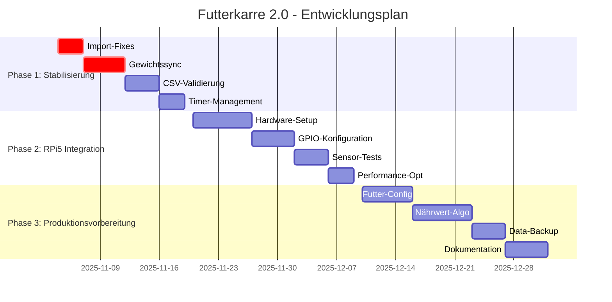

# 🛣️ Futterkarre 2.0 - Entwicklungs-Fahrplan

## 📅 **Zeitplan-Übersicht**



---

## 🔥 **Phase 1: Code-Stabilisierung (Nov 4-19, 2025)**

### **Woche 1: Kritische Bugs (4.-8. Nov)**

#### **Tag 1-2: Import-Fehler beheben** 🔴
```python
# Problem: views/main_window.py Zeile 6
from views.start import StartSeite  # DIESER IMPORT FEHLT!

# Lösung:
# 1. Prüfen ob views/start.py existiert
# 2. Falls nicht: StartSeite-Klasse erstellen
# 3. Import korrigieren und testen
```

**Aufgaben:**
- [ ] `views/start.py` analysieren/erstellen
- [ ] Import in `main_window.py` korrigieren  
- [ ] Startbildschirm-Funktionalität implementieren
- [ ] Unit-Test für StartSeite schreiben

#### **Tag 3-5: Gewichtssynchronisation** 🔴
```python
# Problem: Inkonsistente Gewichtsverwaltung
# - BeladenSeite: karre_gewicht vs. restgewicht
# - FuetternSeite: parallele Gewichtsverfolgung
# - Simulation: fu_sim vs. hx711_sim getrennt

# Lösung: Zentrale WeightManager-Klasse
```

**Aufgaben:**
- [ ] `WeightManager` Singleton erstellen
- [ ] Alle Gewichtsvariablen konsolidieren
- [ ] Event-System für Gewichtsänderungen
- [ ] Simulation-Module synchronisieren
- [ ] Integration-Tests schreiben

---

### **Woche 2: Datenvalidierung (11.-15. Nov)**

#### **CSV-Struktur-Validierung** 🟡
```python
# Problem: Keine Validierung der CSV-Struktur
# Lösung: Robuste CSV-Reader mit Schema-Validierung

class CSVValidator:
    def validate_pferde_csv(self, filepath):
        required_columns = ['Folge', 'Name', 'Gewicht', 'Alter']
        # Implementierung...
```

**Aufgaben:**
- [ ] `CSVValidator` Klasse implementieren
- [ ] Schema-Definition für alle CSV-Typen
- [ ] Fallback-Mechanismen bei fehlerhaften Daten
- [ ] User-freundliche Fehlermeldungen
- [ ] Automatische Daten-Reparatur

#### **Timer-Management zentralisieren** 🟡
```python
# Problem: Mehrfache Timer ohne Koordination
# Lösung: Zentraler TimerManager

class TimerManager:
    def __init__(self):
        self.active_timers = {}
        self.update_intervals = {
            'weight_display': 100,  # 10 FPS
            'sensor_reading': 200,  # 5 FPS  
            'ui_refresh': 500       # 2 FPS
        }
```

**Aufgaben:**
- [ ] `TimerManager` Singleton implementieren
- [ ] Alle UI-Timer konsolidieren
- [ ] Performance-optimierte Update-Zyklen
- [ ] Memory-Leak-Tests durchführen

---

## 🍓 **Phase 2: Raspberry Pi 5 Integration (Nov 20 - Dez 9)**

### **Woche 3: Hardware-Grundlagen (20.-24. Nov)**

#### **RPi5 Hardware-Setup** 📦
**Beschaffung:**
- [ ] Raspberry Pi 5 (8GB) bestellen
- [ ] 4x HX711-Wägesensoren bestellen  
- [ ] 7" Touchscreen bestellen
- [ ] Industriegehäuse (IP65) bestellen
- [ ] 20Ah LiFePO4-Akku + Step-Down bestellen

**Installation:**
- [ ] Raspberry Pi OS Lite (64-bit) installieren
- [ ] SSH/WiFi-Konfiguration
- [ ] GPIO/SPI/I2C aktivieren
- [ ] Python-Abhängigkeiten installieren

#### **GPIO-Konfiguration** ⚡
```python
# Neue Datei: hardware/rpi5_config.py
HX711_PINS = {
    'sensor_1': {'dt': 5, 'sck': 6},   # Ecke Vorne-Links
    'sensor_2': {'dt': 13, 'sck': 19}, # Ecke Vorne-Rechts  
    'sensor_3': {'dt': 26, 'sck': 21}, # Ecke Hinten-Links
    'sensor_4': {'dt': 20, 'sck': 16}  # Ecke Hinten-Rechts
}
```

**Aufgaben:**
- [ ] GPIO-Pin-Mapping definieren
- [ ] Hardware-Detection implementieren
- [ ] RPi5-spezifische Optimierungen
- [ ] Breadboard-Prototyp aufbauen

---

### **Woche 4: Sensor-Integration (27. Nov - 1. Dez)**

#### **HX711-Driver erweitern** 🔌
```python
# Erweiterte Funktionalität für 4-Punkt-Messung
class MultiHX711Manager:
    def __init__(self):
        self.sensors = [HX711(dt, sck) for dt, sck in pin_config]
        self.calibration_factors = [1.0, 1.0, 1.0, 1.0]
    
    def read_total_weight(self):
        weights = [sensor.read() * factor 
                  for sensor, factor in zip(self.sensors, self.calibration_factors)]
        return sum(weights)
    
    def detect_uneven_loading(self):
        weights = self.read_individual_weights()
        variance = np.var(weights)
        return variance > self.max_variance_threshold
```

**Aufgaben:**
- [ ] Multi-Sensor HX711-Manager implementieren
- [ ] Kalibrierungs-Wizard erstellen
- [ ] Ungleichmäßige Beladung erkennen
- [ ] Sensor-Ausfälle kompensieren
- [ ] Performance-Benchmarks auf RPi5

---

### **Woche 5: Performance-Optimierung (2.-6. Dez)**

#### **PyQt5-Touch-Optimierung** 📱
```python
# Touch-Response für Industrie-Umgebung optimieren
class TouchOptimizer:
    @staticmethod
    def configure_for_industrial_use():
        # Längere Touch-Delays für Handschuhe
        app.setDoubleClickInterval(500)
        
        # Größere Touch-Bereiche
        app.setStyleSheet("""
            QPushButton { 
                min-height: 80px; 
                min-width: 120px;
                font-size: 24px;
            }
        """)
```

**Aufgaben:**
- [ ] Touch-Performance auf RPi5 optimieren
- [ ] Handschuh-kompatible UI-Größen
- [ ] Outdoor-Helligkeit anpassen
- [ ] CPU/GPU-Auslastung optimieren
- [ ] Akkulaufzeit-Tests durchführen

---

## 🎯 **Phase 3: Produktionsvorbereitung (Dez 10 - Jan 5, 2026)**

### **Woche 6-7: Feature-Vervollständigung (10.-20. Dez)**

#### **Futter-Konfiguration vollenden** 🌾
```python
# Aktuelle Situation: UI existiert, Integration fehlt
# Problem: views/futter_konfiguration.py ist noch nicht vollständig integriert

# Lösung: MainWindow-Integration abschließen
def show_futter_configuration(self):
    self.show_status("futter_konfiguration")
```

**Aufgaben:**
- [ ] Futter-Konfiguration in MainWindow integrieren
- [ ] CSV-Upload-Funktionalität hinzufügen
- [ ] Futter-Daten Live-Preview implementieren
- [ ] Nährwert-Übersicht erstellen
- [ ] Benutzerfreundliche Fehlermeldungen

#### **Nährwert-Algorithmen** 🧮
```python
# Erweiterte Nährwertberechnung implementieren
class NutritionCalculator:
    def calculate_daily_needs(self, pferd: Pferd, arbeit_level: str):
        # Basiert auf Gewicht, Alter, Arbeitsbelastung
        base_energy = pferd.gewicht * 0.03  # MJ DE/kg
        
        factors = {
            'ruhe': 1.0,
            'leichte_arbeit': 1.25,
            'mittlere_arbeit': 1.5,
            'schwere_arbeit': 1.75
        }
        
        return base_energy * factors.get(arbeit_level, 1.0)
```

**Aufgaben:**
- [ ] Wissenschaftlich fundierte Nährwert-Formeln
- [ ] Alters-/Gewichts-spezifische Berechnungen
- [ ] Fütterungsempfehlungen generieren
- [ ] Über-/Unterfütterung-Warnings
- [ ] Veterinär-Export-Funktion

---

### **Woche 8: Daten & Backup (23.-27. Dez)**

#### **Persistente Datenhaltung** 💾
```python
# Aktuell: Nur CSV-Import, keine Speicherung von Fütterungen
# Lösung: SQLite-Datenbank für Fütterungshistorie

class FutterHistoryDB:
    def __init__(self):
        self.db_path = "data/futter_history.db"
        self.init_database()
    
    def log_fuetterung(self, pferd_id, futter_typ, menge, timestamp):
        # Fütterung in DB speichern
        pass
    
    def get_pferd_statistics(self, pferd_id, timeframe_days=30):
        # Fütterungsstatistiken abrufen
        pass
```

**Aufgaben:**
- [ ] SQLite-Datenbank Design
- [ ] Fütterungshistorie implementieren
- [ ] Automatische Backups (USB/WiFi)
- [ ] Daten-Export für Tierarzt
- [ ] DSGVO-konforme Datenhaltung

---

### **Woche 9: Finalisierung (30. Dez - 3. Jan)**

#### **Benutzerhandbuch & Dokumentation** 📚
**Aufgaben:**
- [ ] Benutzerhandbuch mit Screenshots
- [ ] Installation/Setup-Anleitung für RPi5
- [ ] Kalibrierungs-Prozess dokumentieren
- [ ] Wartungs-/Reinigungshinweise
- [ ] Troubleshooting-Guide
- [ ] Video-Tutorials erstellen

#### **Qualitätssicherung** ✅
**Aufgaben:**
- [ ] Comprehensive Integration Tests
- [ ] Performance-Tests unter Last
- [ ] Akkulaufzeit-Stress-Tests
- [ ] Outdoor-Witterungs-Tests
- [ ] User Acceptance Tests
- [ ] Code-Review & Refactoring

---

## 📊 **Meilenstein-Tracking**

### **Kritische Erfolgsfaktoren:**
| Meilenstein | Datum | Kriterium | Status |
|-------------|--------|-----------|---------|
| **M1: Code-Stabilität** | 19.Nov | Alle Import-Fehler behoben | 🟡 |
| **M2: Hardware-Prototyp** | 1.Dez | RPi5 + 4x HX711 funktional | ⚪ |
| **M3: Touch-Optimierung** | 9.Dez | Flüssige UI auf RPi5 | ⚪ |
| **M4: Feature-Complete** | 20.Dez | Alle Hauptfunktionen implementiert | ⚪ |
| **M5: Produktionsreif** | 3.Jan | Installation beim Kunden möglich | ⚪ |

### **Risiko-Management:**
| Risiko | Wahrscheinlichkeit | Impact | Mitigation |
|--------|-------------------|---------|------------|
| **Hardware-Lieferung verzögert** | Mittel | Hoch | Alternative Lieferanten recherchieren |
| **RPi5-Performance unzureichend** | Niedrig | Hoch | Fallback auf RPi4 vorbereiten |
| **Touch-Response problematisch** | Mittel | Mittel | USB-Tastatur als Backup |
| **Akkulaufzeit zu kurz** | Niedrig | Mittel | Größerer Akku oder Energiespar-Modus |

---

## 🎯 **Quick-Wins für sofort:**

### **Diese Woche (4.-8. Nov):**
1. **Import-Fehler beheben** (1 Tag)
2. **README.md committen** (heute)
3. **Hardware bestellen** (heute)
4. **Gewichtssync-Issue analysieren** (2 Tage)

### **Nächste Woche (11.-15. Nov):**
1. **CSV-Validierung implementieren**
2. **Timer-Management aufräumen**  
3. **Erste RPi5-Tests (falls Hardware da)**

---

**🚀 Let's get started!** Der Plan ist ehrgeizig aber machbar. Der RPi5 wird ein Game-Changer für die Performance sein!